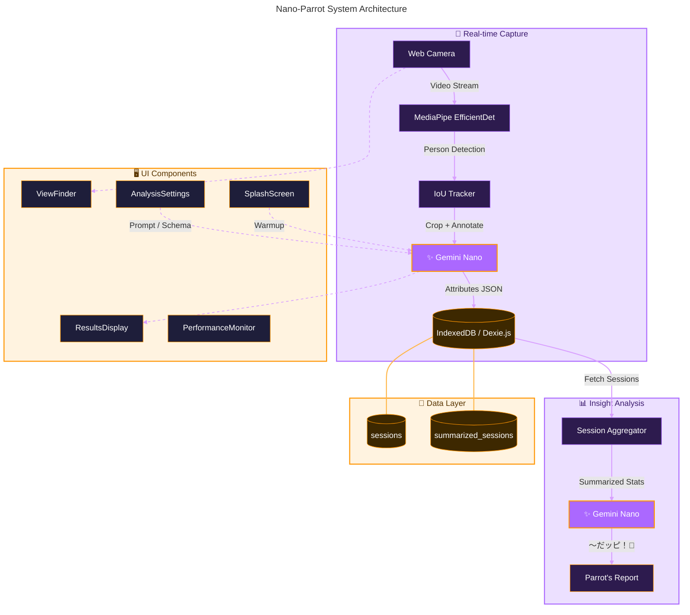

```mermaid
---
title: Nano-Parrot System Architecture
---
graph TD
    subgraph CapturePhase ["🎥 Real-time Capture"]
        direction LR
        Camera["Web Camera"] -->|Video Stream| MP["MediaPipe EfficientDet"]
        MP -->|Person Detection| Tracker["IoU Tracker"]
        Tracker -->|Crop + Annotate| GN1["✨ Gemini Nano"]
        GN1 -->|Attributes JSON| Dexie[("IndexedDB / Dexie.js")]
    end

    subgraph UIComponents ["🖥️ UI Components"]
        direction LR
        VF["ViewFinder"]
        RD["ResultsDisplay"]
        PM["PerformanceMonitor"]
        AS["AnalysisSettings"]
        SS["SplashScreen"]
    end

    subgraph AnalysisPhase ["📊 Insight Analysis"]
        direction LR
        Dexie -->|Fetch Sessions| Agg["Session Aggregator"]
        Agg -->|Summarized Stats| GN2["✨ Gemini Nano"]
        GN2 -->|"〜だッピ！🦜"| Report["Parrot's Report"]
    end

    subgraph DataLayer ["💾 Data Layer"]
        direction LR
        Sessions[("sessions")]
        Summarized[("summarized_sessions")]
    end

    Dexie --- Sessions
    Dexie --- Summarized

    Camera -.-> VF
    GN1 -.-> RD
    AS -.->|Prompt / Schema| GN1
    SS -.->|Warmup| GN1

    %% ── Nano Parrot Theme ──

    %% Subgraph styling
    style CapturePhase fill:#ece0ff,stroke:#ab68ff,stroke-width:2px,color:#3b1a6e
    style UIComponents fill:#fff3e0,stroke:#ff9500,stroke-width:2px,color:#5a3600
    style AnalysisPhase fill:#ece0ff,stroke:#ab68ff,stroke-width:2px,color:#3b1a6e
    style DataLayer fill:#fff3e0,stroke:#ff9500,stroke-width:2px,color:#5a3600

    %% Capture pipeline nodes
    style Camera fill:#2d1b4e,stroke:#ab68ff,color:#fff
    style MP fill:#2d1b4e,stroke:#ab68ff,color:#fff
    style Tracker fill:#2d1b4e,stroke:#ab68ff,color:#fff

    %% Gemini Nano nodes (accent)
    style GN1 fill:#ab68ff,stroke:#ff9500,stroke-width:2px,color:#fff
    style GN2 fill:#ab68ff,stroke:#ff9500,stroke-width:2px,color:#fff

    %% Data nodes
    style Dexie fill:#3d2800,stroke:#ff9500,color:#fff
    style Sessions fill:#3d2800,stroke:#ff9500,color:#fff
    style Summarized fill:#3d2800,stroke:#ff9500,color:#fff

    %% Analysis nodes
    style Agg fill:#2d1b4e,stroke:#ab68ff,color:#fff
    style Report fill:#2d1b4e,stroke:#ff9500,color:#fff

    %% UI Component nodes
    style VF fill:#1e1e3a,stroke:#ff9500,color:#fff
    style RD fill:#1e1e3a,stroke:#ff9500,color:#fff
    style PM fill:#1e1e3a,stroke:#ff9500,color:#fff
    style AS fill:#1e1e3a,stroke:#ff9500,color:#fff
    style SS fill:#1e1e3a,stroke:#ff9500,color:#fff

    %% Links
    linkStyle 0,1,2,3 stroke:#d9a0ff,stroke-width:2px
    linkStyle 4,5,6 stroke:#d9a0ff,stroke-width:2px
    linkStyle 7,8 stroke:#ffb84d,stroke-width:2px
    linkStyle 9,10,11,12 stroke:#d9a0ff,stroke-width:1.5px,stroke-dasharray:5 5
```
